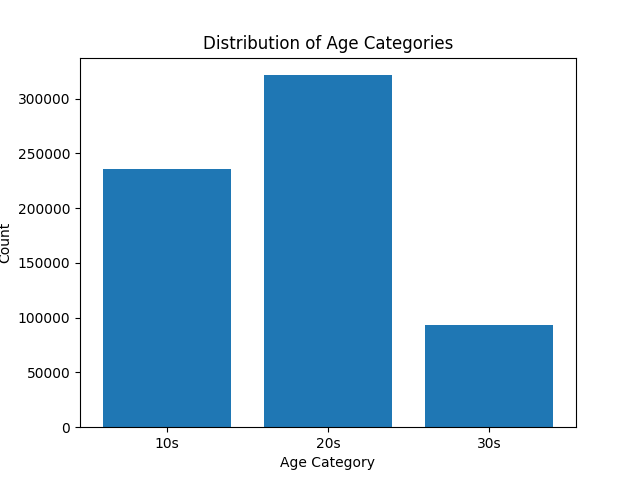
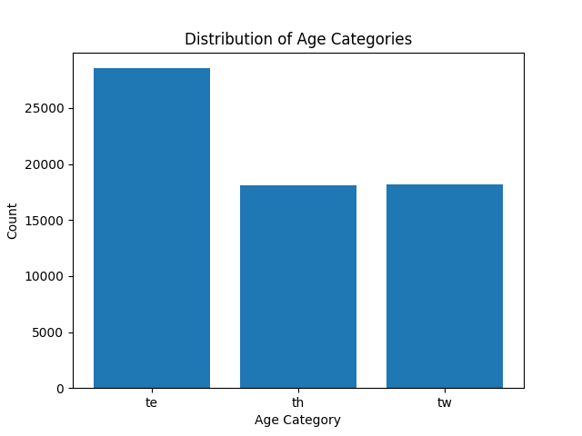
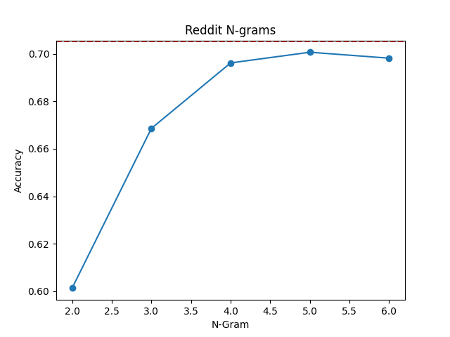
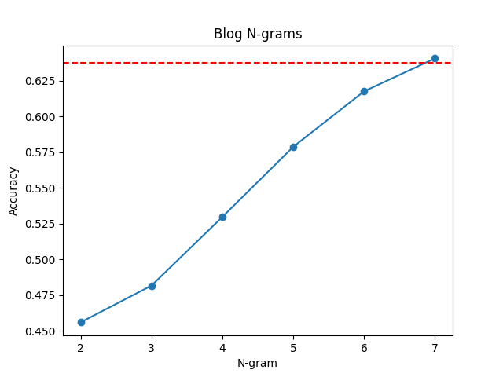

# Text-Based Age Recognition: Final Report

## Introduction

Through this project, I aim to predict the age of an individual based on linguistic markers -- this includes words, punctuation, writing style, and other implicit factors that make up short to medium form written text as a whole. I do think that this is significant when it comes to practical applications like personalized content in a social media context, as well as figuring out general abnormality wnen it comes to seeing text that it supposed to be age-grouped, and could also be used for things like online safety. 

In this report, we describe the way I started the project, the data, methodology, results, and challenges faced during the course of the project.

## Data

I didn't initially have a good idea on how to start with the project, so I went for a data-first approach, where I first found a dataset that I was interested in, and then came up with the problem that I wanted to solve.

### Found Data 

I found the [Blog Authorship Corpus](https://u.cs.biu.ac.il/~koppel/BlogCorpus.htm), and formed the project idea around this. 

Here's a quick overview on the Blog Authorship Corpus:

> The Blog Authorship Corpus consists of the collected posts of 19,320 bloggers gathered from blogger.com in August 2004. The corpus incorporates a total of 681,288 posts and over 140 million words - or approximately 35 posts and 7250 words per person.  

> Each blog is presented as a separate file, the name of which indicates a blogger id# and the blogger�s self-provided gender, age, industry and astrological sign. (All are labeled for gender and age but for many, industry and/or sign is marked as unknown.)

The CSV verison of the dataset, which is identical to the XML files contained some versions of the dataset can be found [here](https://www.kaggle.com/rtatman/blog-authorship-corpus). 

This dataset is stored in a hidden folder and named `data/blogtext \2.csv`. I cannot share this, because I don't have the right to distribute it according to the specofied licansing.

### Value Add

Because this data was mostly gathered and there wasn't too much more to do except preprocessing, I decided to see if I could find other age-grouped datasets that I could use for the same task.

I ended up with crowdsourcing data from reddit forums, also known as subreddits. I tried to find forums that contain a majority age group, so that would serve as an additional dataset. Challenges here were finding text-rich forums instead of just memes or replies to memes.

Here are the following age-marked reddit forums I ended up going with:
- Teens - `r/askteenboys`, `r/askteengirls`
- Twenties - `r/college`, `r/LifeAfterSchool`
- Thirties - `r/AskMenOver30`, `r/AskWomenOver30`

The raw data is contained within the repository in [reddit_data/](reddit_data/) in the respective CSV files, and the combined dataset

Some notes on the reddit data:

I couldn't form more accurate data for age groups, due to lack of widely available data for specific ages like twenties and thirties only, hence I found data groups that tends to be used by people who are closer to their 20s (as in `r/College`) and 30+ year olds (as in `r/AskMenOver30` and `r/AskWomenOver30`). This means that there might be 18 year olds who use `r/College`, but I do think that it should be a seperate category anyway, since they more closely resemble 20-something year olds rather than early teenagers. This still serves the intended purpose for grouping text for safety and personalization.


The data points are comment text, not post text. This is because the chosen subreddits are usually in the format of "ask an X year old", where the main text might not be someone who is of that age group. 

Plus this means that the data is more clean with fewer links, news headlines, meme text etc. I also made sure to not get nested replies (ie. replies of a reply), because it could be an author reply (and the author doesn't necessarily fall into that age group).

### Data Pipeline

For the reddit data pipeline, I ran the script [`reddit_comment_fetch.py`](scripts/reddit_comment_fetch.py) on the subreddits that I was planning on using and collected the raw CSVs that are contained in [`reddit_data/`](reddit_data/). I then imported it and processed it in the [notebook](notebooks/data_extraction/process_reddit_data.ipynb). 


## Analysis

### Exploratory data analysis


Here is a breakdown of the posts made in the Blog Authorship Corpus, grouped by Age.



Since this dataset is predefined, I left it as is.

During the extraction of the reddit dataset, which can be found [here](notebooks/data_extraction/process_reddit_data.ipynb), I looked at various factors like the age distribution, distribution of text length, etc. and tried to balance out the dataset as a whole.

Here is the distribution of the Reddit data, grouped by age.




### Preprocessing

In the notebooks that are contained under the subfolder [draft](notebooks/data_analysis/draft/), one of the main experiments that I ran were to figure out whether to pre-process or not to pre-process. From both the reddit and the blog dataset, the accuracies were fairly similar, but I did feel like we were losing a lot of context by remoing all punctuation, capitalization, and reducing words to their base form.

I did end up going with a partial pre-processing (more so, data cleaning) approach that cleaned up the data, removed links, removed non-alpha characters, and filtered out text that was too short. The section on Classification and Learned Features will describe how this data works with the algorithm.

### Feature Extraction

I did end up going with a Count Vectorizer for this project. I tried out a TF-IDF vectorizer, and it wasn't as effective in terms of accuracy. The subfolder [draft](notebooks/data_analysis/draft/) contains the experiment where I tried to see if it was relevant.


### Classification and Learned Features

For this project, I ended up going with a Naive Bayes Classifier (`MultiNomialNB`) that is included in `scikit-learn`. This is because, since it is a probabilistic model, the time taken to train the model is low, which is good for this use-case since multiple models have to be trained and tested as a part of the analysis. There is also a section at the end of [`notebooks/data_analysis/draft/reddit.ipynb`](notebooks/data_analysis/draft/reddit.ipynb) that contains details on model improvements. Turns out, the MultiNomialNB is one of the best ones.

I used both a Bag-of-Words approach, as well as character-level N-grams. I believed that character level N-grams would be useful in capturing the context. The BoW models generally did better than the N-grams for smaller N, but accuracy generally grew as the N went up.

#### Reddit Data



#### Blog Data



#### Analysis of N-Grams vs BoW

One interesting thing that I found was that although the accuracies were fairly close with N-grams and BoW for N=5/6/7 (N-grams > BoW for Blog, BoW > N-grams for Reddit), the learned features were actually a lot different. 

**For Blog data, here are some of the most significant features for BoW**

```
'oratote', 'comreligion', 'notquiteright', 'holderjoint', 'Muhahahhaha', 'Casacommunitas', 'slurtalking', 'smilingandflirting', 'LisaaaaAAA', 'Reng'
```
and N-grams
```
'ason, S', 'cate al', 'nse aff', 'ofit.As', 'nn Proj', ' eh!! d', '. NO BR', 'wns his', 'ch warm'
```

**For Reddit data, here are some of the most significant features for BoW**

```
'Pratchetts', 'knockout', 'skipping', 'combines', 'Urban', 'Hongkonger', 'simulator', 'adjustments', 'OOP'
```
and N-grams
```
'ned e', 'tucki', 'void.', 'ay. y', 'A foc', 'sy, a', 'rong ', 'ght h'
```

It seemed to me like N-grams was picking up on punctuation and spacing, different features from just the words.

I wanted to try an ensemble that used the features from both N-grams and BoW, but didn't have enough time.

## Challenges

#### Data Pipeline

Coming up with the plan to extract the value-add data was difficult. It took a long time to find the subreddits, and come up with a plan to etract the right attributs from a post to get noise-free data that I could use for analysis.

Getting the script set up without errors or issues to do the data scraping was also a big challenge, since I wasn't able to monitor it constantly. Here is a description of the task from my project report - 

> I ran the data pipeline on all of the data and attempted to get over 10k data points for each subreddit -- so 20k per category. I anticipated noise and very short comments so I gathered 15k-20k within each category anyway to get a worst-case scenario fault tolerance of 50%. This took 60+ hours to run on my machine with 16GB DDR4 RAM, a large part of which was API rate limits. 

## Future Work and Improvements

There are several areas in which the model can be improved and further research can be conducted. Some of the potential future work and improvements include:

### Language Verification

The Blog dataset actually doesn contain data that was written in languages other than English. I tried to address some of this by filtering "alpha" characters and then removing data points without substantial text, but using a pre-trained model and incorporating a language verification step in our data preprocessing pipeline would be the best way. By using language detection libraries, such as `langdetect` or `fasttext`, I could filter out non-English posts, which could potentially improve the performance of the model and come up with better features to look for.

### Expanding the Dataset

To further solidify the conclusions, I can collect more data from the same, and potentially, a wider variety of subreddits and age groups. This will allow the model to capture a more diverse set of linguistic patterns and prevent overfitting to specific subreddits or age groups.

### Exploring Advanced NLP Techniques

Maybe Neural Networks?

## Conclusion

The reddit data was somehow cleaner than the Blog Authorship Corpus, and made more sense. This was the opposite to what I was expecting. The analysis was also super fun to watch, seeing how different factors influenced what the features were that influenced the model to act a certain way.

I liked this project. I learned a lot.

